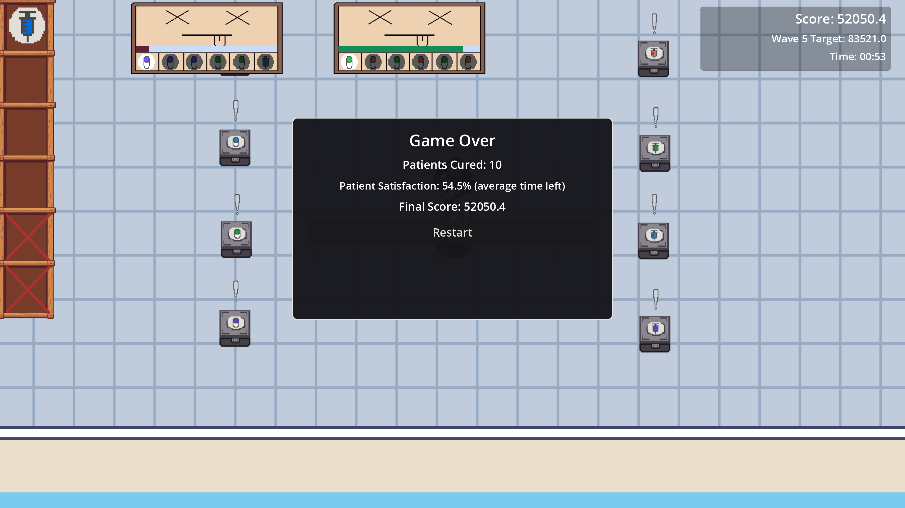

# MH Clinic Rush

  A fast-paced 2D pixel-art clinic game made in Godot where you collect medicine items and submit them to patient orders in the correct sequence before time runs out.

  ## Gameplay
  - Collect items from medicine boxes.
  - Submit items at the patient station in the correct order.
  - Manage multiple active order cards at once.
  - Earn score based on speed and order size.
  - Survive waves, choose buffs, and handle increasing difficulty.

  ## Win / Lose
  - You lose if session time ends or lives reach 0.
  - You win when final score reaches the target threshold (difficulty-based).

  ## Controls
  - `Arrow Keys` = Move
  - `Enter` / `Space` = Interact
  - `T` (`test` input) = Pause / Resume

  ## Built With
  - Godot Engine 4.6
  - GDScript

some screenshots

## Credits:

Hospital assets: "Top Down Hospital" by Soppycraft  
[https://soppycraft.itch.io/top-down-hospital](https://soppycraft.itch.io/top-down-hospital)

​  

Music: "Cat Walk" by Sakura Girl  

[https://soundcloud.com/sakuragirl_official](https://soundcloud.com/sakuragirl_official)  
Music promoted by [https://www.chosic.com/free-music/all/](https://www.chosic.com/free-music/all/)  

Licensed under Creative Commons CC BY 3.0  

[https://creativecommons.org/licenses/by/3.0](https://creativecommons.org/licenses/by/3.0)

​
